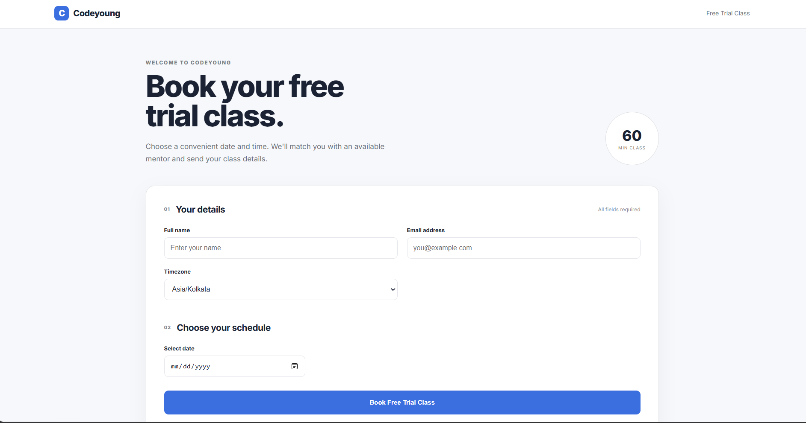
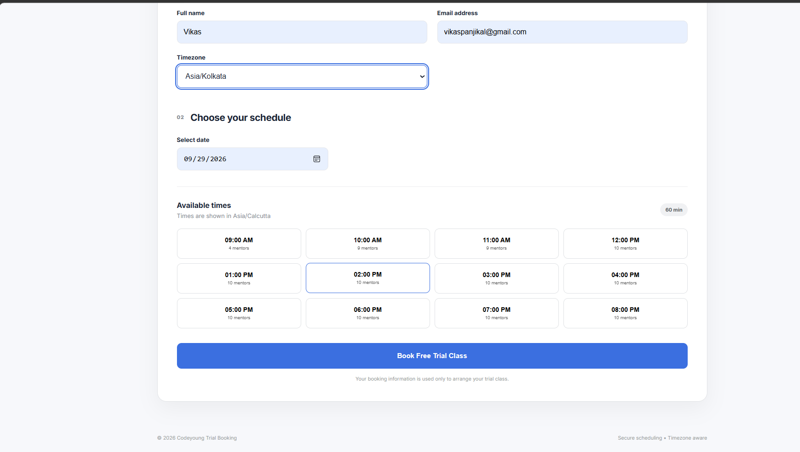
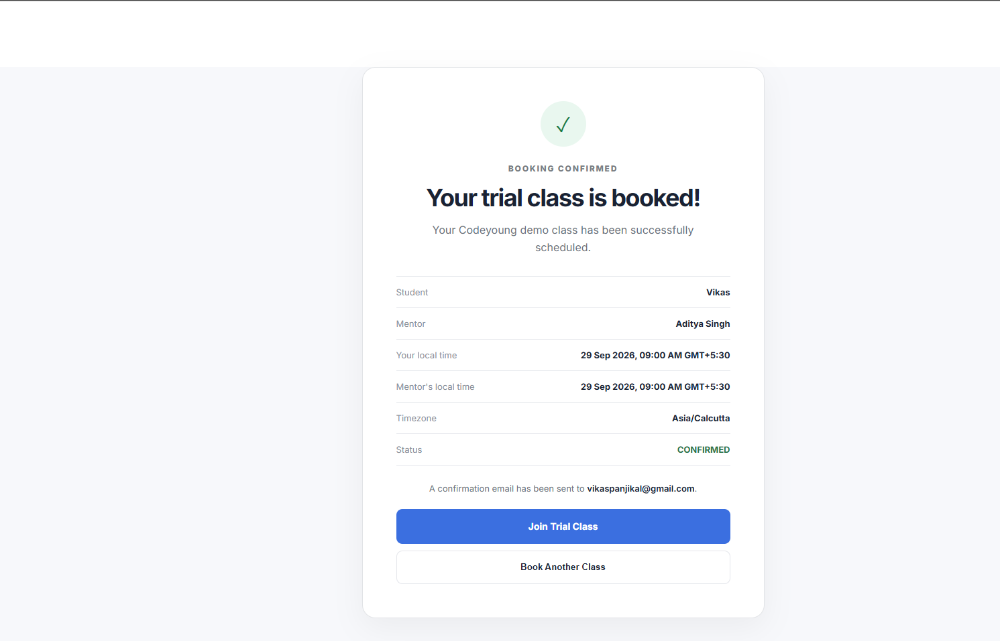
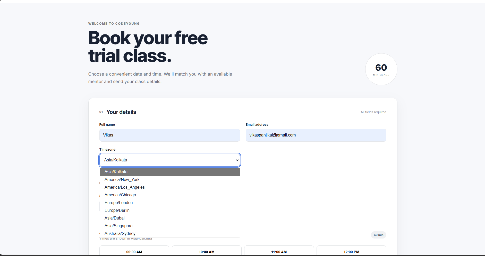
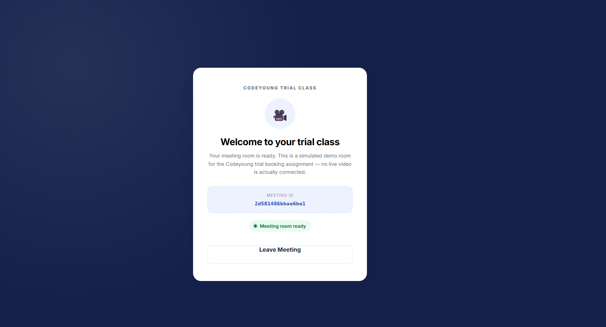
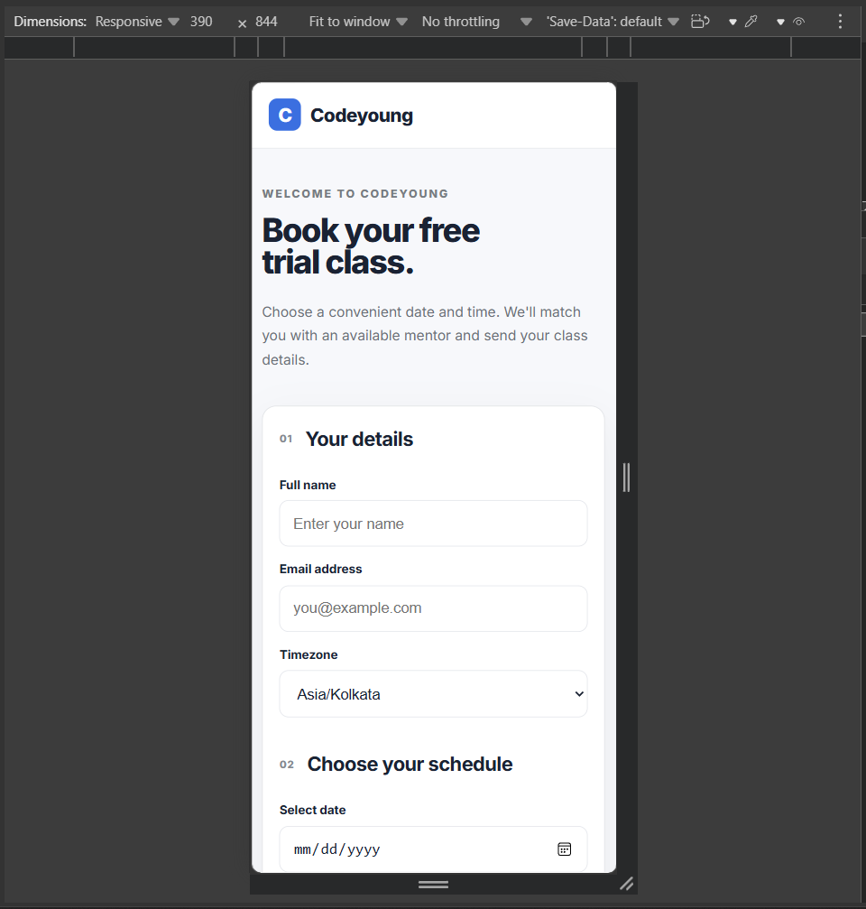

**# Codeyoung Trial Class Booking System**

A full-stack appointment-booking system for Codeyoung's free trial classes.

Parents pick a date, time, and timezone; the system finds an available

mentor, books the class, generates a simulated meeting link, and (when

configured) emails both parties.

Built for the Codeyoung Full-Stack Developer recruitment assignment.

---

## Screenshots

### Booking Page

### Available Time Slots

### Booking Confirmation

### Timezone Support

### Trial Class Meeting Room

### Responsive Mobile UI

---

\---

**## Overview**

\- **\*\*10 active mentors\*\***, all based in \`Asia/Kolkata\`, each working 9:00 AM–9:00 PM local time. (See "Design Decisions" for why the demo data uses one mentor timezone rather than several.)

\- Supports **\*\*up to 20 parent bookings/day\*\*** through the 10-mentors × 2-classes/day capacity model.

\- Parents can book from **\*\*any IANA timezone\*\***; the system converts correctly to UTC and to each mentor's local time.

\- **\*\*Daylight Saving Time\*\*** is handled explicitly, in both the slot list and at booking time — a local time that does not exist because of a DST spring-forward is never shown as a bookable slot and is rejected with a clear error if requested directly.

\- **\*\*Concurrency-protected\*\***: an atomic MongoDB reservation (\`findOneAndUpdate\` with \`$lt\`) plus a unique compound index prevents two simultaneous requests from double-booking a mentor.

\- A simulated meeting room page (\`/meeting/\:id\`) is served by the frontend when "Join Trial Class" is clicked.

\- **\*\*Rate limited\*\***: the booking endpoint and the read-only availability endpoints have basic per-IP rate limits to blunt scripted abuse without interrupting normal use.

\---

**## Features**

\- Book a trial class by name, email, timezone, date, and time slot.

\- Real-time available-slot list, showing how many mentors can take each hour.

\- Automatic mentor assignment, load-balanced across mentors with the fewest classes that day.

\- Hard limit of 2 classes per mentor per **\*\*mentor's local calendar day\*\***.

\- DST-aware validation both when generating the slot list and when a booking is submitted — a local time that doesn't exist because of a spring-forward gap is never offered as a slot, and ambiguous fall-back times resolve deterministically to their first occurrence rather than creating confusing duplicates.

\- Confirmation screen showing the actual assigned mentor, both parties' local times, and a note confirming which email address the confirmation was sent to — all sourced directly from the server response.

\- Simulated "Join Trial Class" meeting room page with a unique meeting ID.

\- **\*\*Two distinct email notifications\*\*** via Gmail SMTP (Nodemailer): a parent confirmation ("Your Codeyoung Trial Class is Confirmed") and a separate mentor assignment notice ("New Codeyoung Trial Class Assigned"), each with content relevant to that recipient. A safe console-log fallback runs when SMTP isn't configured, so the app runs in development without any email setup, and an email failure never destroys an already-created booking.

\- Friendly, specific error messages for every failure case (invalid input, DST conflict, no mentors available, slot just taken, network failure, rate limited) — no raw stack traces reach the client.

\- Responsive UI from mobile (375px) through desktop (1920px+), with loading skeletons, empty states, and keyboard-focus states.

\---

**## Tech Stack**

**\*\*Backend:\*\*** Node.js, TypeScript, Express 5, MongoDB, Mongoose, Zod, Luxon, Nodemailer

**\*\*Frontend:\*\*** React 19, TypeScript, Vite, React Router, Axios

\---

**## Architecture**

\`\`\`

Backend:

  Routes → Controllers → Services → Models → MongoDB

Frontend:

  React Pages/Components → API Service (axios) → REST API → Backend Services → MongoDB

\`\`\`

Controllers stay thin (validate input with Zod, call a service, shape the HTTP response).

All booking, availability, timezone, and capacity logic lives in \`services/\`.

\---

**## Project Structure**

\`\`\`

codeyoung-trial-booking/

├── client/

│   ├── src/

│   │   ├── components/        # TimezoneSelector, SlotGrid (presentational)

│   │   ├── pages/              # BookingPage, MeetingPage (route-level)

│   │   ├── services/api.ts     # axios client, typed API calls

│   │   ├── types/booking.ts    # types matching the real API response shape

│   │   ├── utils/dateUtils.ts  # local-date helper (avoids UTC/local date bug)

│   │   ├── App.tsx             # router shell

│   │   └── main.tsx            # React root + BrowserRouter

│   └── vite.config.ts

└── server/

    └── src/

        ├── config/             # booking rules, MongoDB connection

        ├── controllers/        # HTTP layer (validation + response shaping)

        ├── middleware/         # global 404 + error handler, rate limiter

        ├── models/             # Mentor, Parent, Booking, MentorDailyCapacity

        ├── routes/

        ├── seed/mentors.ts     # seeds the 10 required mentors

        ├── services/           # booking, mentor, slot, capacity, timezone, email

        └── utils/meetingLink.ts

\`\`\`

\---

**## Booking Flow**

1\. Parent fills in name, email, and timezone, then picks a date.

2\. Frontend calls \`GET /api/slots?date=...&timezone=...\`, which returns every

   hourly slot that has **\*\*at least one\*\*** available mentor, along with the

   exact count of mentors free at that slot.

3\. Parent selects a slot and submits.

4\. \`POST /api/bookings\` re-validates everything server-side (never trusts the

   client), converts the local time to UTC, finds available mentors sorted

   by lowest current daily load, and tries them in order:

   - atomically reserve daily capacity (\`MentorDailyCapacity\`)

   - re-check for an exact overlap (final race-condition guard)

   - create the \`Booking\` document

   - generate a meeting link and (try to) send confirmation emails

5\. Server returns the mentor's name, both local times, the meeting link, and status.

6\. Frontend shows the confirmation screen using that server response — not

   locally-typed form state — so the assigned mentor is always shown correctly.

7\. "Book Another Class" re-fetches availability from the server instead of

   reusing stale in-memory data.

\---

**## Timezone Handling**

\- Parent's date + time + timezone is parsed with **\*\*Luxon\*\***, in the

  parent's timezone, then converted to UTC (\`localTimeToUTC\`).

\- The mentor's working hours (9 AM–9 PM) are checked in the \*\*mentor's own

  timezone\*\*, never the parent's.

\- All bookings are stored in UTC (\`startTimeUTC\` / \`endTimeUTC\`).

\- Every display of a time to a human (confirmation screen, email) is

  produced by converting UTC back into that person's own timezone.

**## DST Handling**

\- **\*\*At booking time\*\***: \`validateLocalDateTime\` builds the requested local time in Luxon, then round-trips it back through the same timezone. If the round-trip doesn't match what was requested, that local time **\*\*does not exist\*\*** (a spring-forward gap) and a clear validation error is thrown instead of silently normalizing to some other time.

\- **\*\*At slot-generation time\*\***: the same round-trip check runs for every hourly candidate slot before it's added to the list. This matters because Luxon's \`DateTime#set()\` does **\*\*not\*\*** reject a nonexistent local time on its own — it silently shifts it forward to the next valid instant. Without this check, a spring-forward day could show two slots (e.g. one built from \`hour: 2\` and one from \`hour: 3\`) that both silently resolve to the same real instant and both display as the same time — a confusing duplicate the parent shouldn't see. The fix skips the nonexistent hour entirely rather than shifting or duplicating it.

\- Ambiguous times during a fall-back (an hour that occurs twice) resolve to a single, deterministic instant — Luxon/IANA's standard "first occurrence" — so the slot list never shows two entries that both claim to be, say, "1:00 AM."

\- Verified directly against the 2026 US DST transitions (March 8 spring-forward, November 1 fall-back) with a standalone script exercising the actual slot-generation function — see \`TRANSCRIPT.md\` for the exact output.

**## Mentor Capacity Rules**

\- Each of the 10 mentors can take \*\*at most 2 classes per local calendar

  day\**\*, computed using the mentor's \*own\** timezone, not the parent's and

  not UTC.

\- A UTC instant is mapped to the mentor's local calendar day

  (\`getLocalDate\`) before counting existing bookings for that day.

\- A booking at one time slot only affects **\*\*that mentor's\*\*** future

  availability — it does not reduce the mentor count shown at unrelated

  time slots, and it does not affect other mentors at all.

**## Mentor Assignment**

\- For a requested time, all active mentors are checked for: working hours,

  no overlapping booking, and daily class count < 2.

\- Available mentors are sorted by ascending classes-already-booked-today,

  so load is spread across the pool rather than repeatedly picking the

  same mentor.

\- If several mentors are tied for lowest load, one is picked at random

  among the tied candidates.

**## Email Notifications**

Two separate emails are sent after a successful booking, each with its

own subject and content, since a parent confirmation and a mentor

assignment notice serve different purposes:

\- **\*\*Parent\*\*** — subject *\*"Your Codeyoung Trial Class is Confirmed"\**, containing the parent/student name, assigned mentor's name, date, time, the parent's own timezone, and the meeting link.

\- **\*\*Mentor\*\*** — subject *\*"New Codeyoung Trial Class Assigned"\**, containing the student's name and email, the date, the class time in the **\*\*mentor's own local time and timezone\*\***, and the meeting link.

Both go through the same underlying transport (\`getTransporter()\` in

\`email.service.ts\`), which is built lazily on first use rather than at

module-import time — building it eagerly caused a real bug during

development where the transporter got permanently cached as \`null\` if

the module loaded a moment before \`.env\` was read (see \`TRANSCRIPT.md\`).

If SMTP isn't configured, both emails fall back to a \`[DEV] ... skipped\`

console log instead of throwing, so local development works without any

email setup. If sending fails for a fully-configured SMTP account (e.g. a

transient network error), the failure is logged but does not roll back or

fail the already-created booking — the parent still gets their

confirmation screen and meeting link either way.

**## Database Schema**

**\*\*Mentor\*\***: \`name\`, \`email\` (unique), \`timezone\`, \`isActive\`

**\*\*Parent\*\***: \`name\`, \`email\` (**\*\*unique\*\***), \`timezone\`

  - the unique index on \`email\` means two concurrent first-time bookings

    from the same new parent email can race on \`Parent.create()\`; the

    losing request catches the resulting MongoDB duplicate-key error

    (code \`11000\`) and re-fetches the record the other request just

    created, rather than surfacing a 500.

**\*\*Booking\*\***: \`parentId\`, \`mentorId\`, \`startTimeUTC\`, \`endTimeUTC\`, \`parentTimezone\`, \`mentorTimezone\`, \`meetingLink\`, \`status\`

  - unique index on \`{ mentorId, startTimeUTC }\` — a hard database-level

    guarantee against two confirmed bookings for the same mentor at the

    same instant.

**\*\*MentorDailyCapacity\*\***: \`mentorId\`, \`localDate\`, \`bookingCount\` (0–2)

  - unique index on \`{ mentorId, localDate }\`, used as an atomic counter

    (\`findOneAndUpdate\` with a \`bookingCount < 2\` filter) to reserve

    capacity safely under concurrent requests.

**## API Endpoints**

\| Method | Path                    | Description                                   | Rate limit |

\|--------|-------------------------|------------------------------------------------|------------|

\| GET    | \`/api/health\`           | Health check                                   | none |

\| GET    | \`/api/slots\`             | Available hourly slots for a date + timezone   | 60/min/IP |

\| GET    | \`/api/mentors/availability\` | Mentors available at an exact date/time/tz  | 60/min/IP |

\| POST   | \`/api/bookings\`          | Create a booking                               | 10/min/IP |

All error responses share the shape \`{ success: false, message: string }\`.

Validation errors additionally include a Zod \`errors\` object. A

rate-limited request receives a \`429\` with the same shape and a

customer-friendly message ("Too many booking attempts. Please wait a

moment and try again.").

**## Environment Variables**

**\*\*server/.env\*\*** (see \`server/.env.example\`):

\`\`\`

MONGODB_URI=mongodb://127.0.0.1:27017/codeyoung-trial-booking

PORT=5000

CORS_ORIGIN=http\://localhost:5173

FRONTEND_URL=http\://localhost:5173

SMTP_HOST=

SMTP_PORT=587

SMTP_SECURE=false

SMTP_USER=

SMTP_PASSWORD=

EMAIL_FROM=

\`\`\`

Leave the \`SMTP\_\*\` variables blank to run without email — bookings still

work, and the email content is logged to the server console instead.

**\*\*client/.env\*\*** (see \`client/.env.example\`):

\`\`\`

VITE_API_BASE_URL=http\://localhost:5000/api

\`\`\`

\---

**## Local Setup**

**### Prerequisites**

\- Node.js 18+

\- A running MongoDB instance (local install, Docker, or Atlas)

**### Backend Setup**

\`\`\`bash

cd server

npm install

cp .env.example .env       # then edit MONGODB_URI etc. if needed

npm run seed\:mentors       # seeds the 10 required mentors

npm run dev                # starts on http\://localhost:5000

\`\`\`

**### Frontend Setup**

\`\`\`bash

cd client

npm install

cp .env.example .env       # defaults to http\://localhost:5000/api

npm run dev                # starts on http\://localhost:5173

\`\`\`

**### Running the Application**

With MongoDB running, start the backend (\`server\`) and frontend (\`client\`)

in two terminals as above, then open \`http\://localhost:5173\`.

\---

## Testing

This repository does not include an automated test suite. The booking,
timezone, capacity, validation, and frontend flows were manually verified
during development using the actual application and service functions.

| # | Test | Result |
|---|------|--------|
| 1 | Normal booking end-to-end | Pass |
| 2 | Repeated booking of one slot counts 10 → 0, then disappears | Pass |
| 3 | Booking one slot does not change other slots' mentor counts | Pass |
| 4 | Mentor cannot exceed 2 classes per local day | Pass |
| 5 | Mentor with 2 classes today is available again tomorrow | Pass |
| 6 | Daily capacity uses the mentor's local date, not the parent's date | Pass |
| 7 | Parent timezone → UTC conversion | Pass |
| 8 | Mentor timezone → UTC conversion | Pass |
| 9 | DST spring-forward nonexistent local time is rejected | Pass |
| 9b | DST spring-forward nonexistent time is excluded from generated slots | Pass — bug identified and fixed |
| 10 | DST fall-back ambiguous local time resolves deterministically | Pass |
| 11 | Concurrent booking race protection | Code-level verification |
| 12 | No-availability error returns a clean 400 response | Pass |
| 13 | Email delivery with SMTP configured | Not live-tested — SMTP credentials unavailable |
| 14 | Application runs without SMTP configured | Pass |
| 15 | Join Trial Class opens the meeting page | Pass |
| 16 | Book Another Class refreshes availability | Pass |
| 18 | Mobile responsiveness (375px–1920px) | Pass |
| 19 | Invalid form input messaging | Pass |
| 20 | Backend-unavailable error messaging | Pass |

### Concurrency verification

A live two-request concurrency test was not executed in this development
environment. The protection was verified by inspecting the actual database
logic.

`reserveMentorDailyCapacity` uses an atomic `findOneAndUpdate` operation
with a `bookingCount < 2` condition and `$inc`. The `Booking` collection
also has a unique index on:

`{ mentorId, startTimeUTC }`

These provide two independent protections against exceeding mentor
capacity and creating duplicate bookings for the same mentor and slot.

A live concurrency test against a production-like MongoDB instance should
be performed before production deployment.

### Email verification

The application supports SMTP-based booking emails. The SMTP code path was
reviewed, but live delivery was not tested because SMTP credentials were
not available during development.

When SMTP is not configured, the application uses a development fallback
and logs the booking email information instead of failing the booking.

**## Design Decisions**

\- \*\*Mentor working hours are always evaluated in the mentor's own

  timezone\*\*, independent of the parent's timezone — this was called out

  explicitly in the assignment and is easy to get backwards.

\- **\*\*Availability is computed per time slot, per mentor\*\***, by checking real

  overlaps and the real daily count — not by decrementing a single shared

  counter — so booking one slot never affects unrelated slots.

\- **\*\*Capacity reservation is atomic at the database level\*\*** rather than

  relying on an in-memory lock, since Node's single-threaded event loop

  doesn't protect against multiple server instances or interleaved async

  operations.

\- **\*\*The confirmation screen renders exactly what the server returned\*\***,

  not what the parent typed into the form, so the displayed mentor name

  and local times are always authoritative.

\- Meeting rooms are a real React route (\`/meeting/\:id\`) rather than a

  dead link, so the "Join Trial Class" flow is actually demonstrable.

\- **\*\*All 10 demo mentors use \`Asia/Kolkata\`, on purpose.\*\*** The original

  brief states this as the real product's actual operating model ("parents

  are in the US or UK, and mentors are in India"), so diversifying mentor

  timezones would contradict the one concrete fact given about Codeyoung's

  real setup. Cross-timezone conversion is still fully exercised and

  demonstrable — through the *\*parent's\** timezone selector, which accepts

  any IANA zone — which mirrors how the real system actually works, rather

  than a hypothetical where mentors are scattered worldwide. Giving

  different mentors different timezones would also require each mentor to

  have their *\*own\** configurable working-hour window (a 9am–9pm mentor in

  IST and a 9am–9pm mentor in PST cover very different absolute UTC

  ranges), which is a real architecture change beyond what this seed-data

  question calls for.

\- **\*\*No per-parent daily booking limit.\*\*** The assignment does not state

  this as a requirement, and it was deliberately left out rather than

  added speculatively — see "Future Improvements" for why it might be

  worth adding later, and why it wasn't added now.

**## Security Considerations**

\- \`.env\` is git-ignored; only \`.env.example\` (no real secrets) is committed.

\- SMTP/Mongo credentials are never hard-coded and never sent to the frontend.

\- CORS is restricted to a single configurable origin (\`CORS_ORIGIN\`), not a wildcard.

\- All input is validated server-side with Zod — frontend validation exists

  only for UX, never as the sole guard.

\- Error responses never leak stack traces; unexpected errors fall through

  a single global handler that returns a generic message.

\- Mongoose's built-in query builders are used throughout (no raw string

  query construction), which avoids NoSQL injection via operator injection

  on plain string/date fields.

\- Basic per-IP rate limiting on the booking endpoint (10/min) and the

  availability endpoints (60/min) blunts scripted abuse — e.g. a script

  rapidly exhausting the day's 20-booking capacity, or hammering the SMTP

  provider — without a limit tight enough to interrupt a real parent

  retrying after a validation error or a "slot just booked" race.

**## Limitations**

\- No authentication — anyone with the URL can book a slot, matching the

  scope of the assignment (a public trial-class booking form).

\- No cancellation/rescheduling flow.

\- No automated test suite; verification was manual/scripted (see Testing).

\- Live concurrent-request behavior (test 11) was verified by code review,

  not a live simultaneous-request run, due to sandbox network restrictions

  during development.

\- Meeting rooms are fully simulated — there is no real video integration.

**## Future Improvements**

\- Add an automated test suite (e.g. Vitest + Supertest against a real or

  Testcontainers-backed MongoDB) covering the scenarios in Testing below.

\- Consider a **\*\*one trial class per parent per day\*\*** rule, keyed on

  normalized email + the relevant local calendar date. This is a product

  decision, not an assignment requirement — real trial-class products

  commonly cap free trials per customer, but nothing in the brief asks for

  it, and adding it now would mean guessing at the right customer-facing

  behavior (block entirely? allow a second child under the same parent

  email? which local date — parent's or mentor's?) without a clear

  specification to design against.

\- Add booking cancellation and mentor-side booking management.

\- Add pagination/date-range querying for slots beyond a single day.

\- Make rate limits configurable via environment variables rather than

  fixed constants, if different environments need different thresholds.

---
